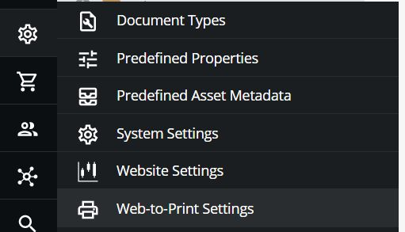

[](https://github.com/drud/ddev-pdfreactor/actions/workflows/tests.yml) 

## What is ddev-pdfreactor?

This repository allows you to quickly install [PDFreactor](https://www.pdfreactor.com/) into a [Ddev](https://ddev.readthedocs.io) project using just `ddev get drud/ddev-pdfreactor`.

## Installation

1. `ddev get drud/ddev-pdfreactor`
2. `ddev restart`

## Explanation

This pdfreactor recipe for [ddev](https://ddev.readthedocs.io) installs a [`.ddev/docker-compose.pdfreactor.yaml`](docker-compose.pdfreactor.yaml) using the [`realobjects/pdfreactor`](https://hub.docker.com/r/realobjects/pdfreactor/) docker image.

## Interacting with PDFreactor

* The PDFreactor instance will listen on TCP port 9423 (the PDFreactor default).
* Configure your application to access PDFreactor on the host:port `pdfreactor:9423`.

## Example to use this PDFreactor service with the official PDFreactor Web Service PHP client

```php
<?php
// Include PDFreactor class
// You can download the PDFreactor Web Service PHP client from: 
// http://www.pdfreactor.com/download/get/?product=pdfreactor&type=webservice_clients&jre=false
require_once('PDFreactor.class.php');
use com\realobjects\pdfreactor\webservice\client\PDFreactor;
use com\realobjects\pdfreactor\webservice\client\PDFreactorWebserviceException;
// Create new PDFreactor instance
$pdfReactor = new PDFreactor('http://pdfreactor:9423/service/rest');

$config = [
    // Specify the input document
    'document'=> 'http://www.pdfreactor.com/product/samples/textbook/textbook.html',
];

// Render document and save result to $result 
$result = null;
try {
    $result = $pdfReactor->convertAsBinary($config);
    header('Content-Type: application/pdf');
    echo $result;
} catch (PDFreactorWebserviceException $e) {
    echo '<h1>An Error Has Occurred</h1>';
    echo '<h2>' . $e->getMessage() . '</h2>';
}
```

More infos: [https://www.pdfreactor.com/php/](https://www.pdfreactor.com/php/)

## Example to use this PDFreactor service with Pimcore

1. Install Pimcore demo
```
mkdir -p pimcore-demo
cd pimcore-demo
ddev config --project-type=php --docroot=public --webserver-type=apache-fpm --create-docroot --php-version=8.0 --database=mariadb:10.5
ddev composer create -y -n pimcore/demo
ddev exec php vendor/pimcore/pimcore/bin/pimcore-install --admin-username admin --admin-password demo --mysql-host-socket db --mysql-username db --mysql-password db --mysql-database db --no-interaction
```
2. Install ddev-pdfreactor Addon
```
ddev get drud/ddev-pdfreactor
ddev restart
```
3. Config
    1. When you have a PDFreactor license key you can add this to `.ddev/pdfreactor/licensekey.txt`
    2. Login to the admin interface https://pimcore-demo.ddev.site/admin (Username: admin, Password: demo)
    3. Go to the Web2Print settings

    

    4. Set the config and click the save button

    | Setting  | Value                         |
    |----------|-------------------------------|
    | Tool     | PDFreactor                    |
    | Protocol | http                          |
    | Server   | pdfreactor                    |
    | Port     | 9423                          |
    | BaseURL  | http://pimcore-demo.ddev.site |

4. Test a Print document
   1. Execute Maintenance Worker:
   
      `ddev php bin/console messenger:consume pimcore_core pimcore_maintenance`

   3. Go to the demo Print catalog (/print/Demo-Catalog)
   4. Click to "Generate PDF" button

## Currently no ARM64 Docker image available

PDFreactor currently do not provide ARM64 images for the Docker image. They are planning to support this with the release of the next major version of PDFreactor (PDFreactor 12).

## License

ddev-pdfreactor is distributed under the [Apache 2.0 license](LICENSE).

**Contributed and maintained by [@blankse](https://github.com/blankse)**
